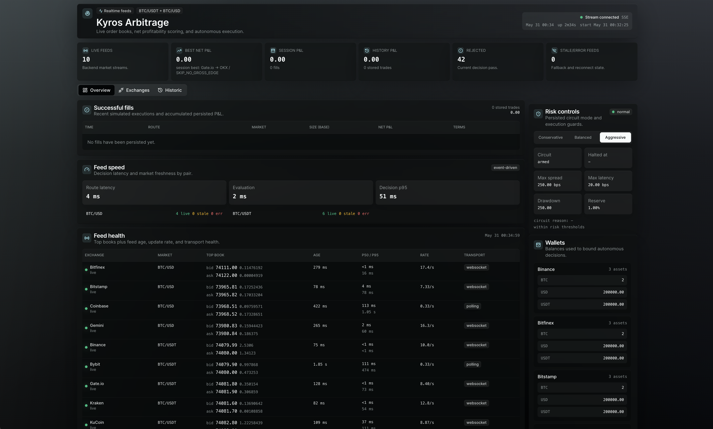
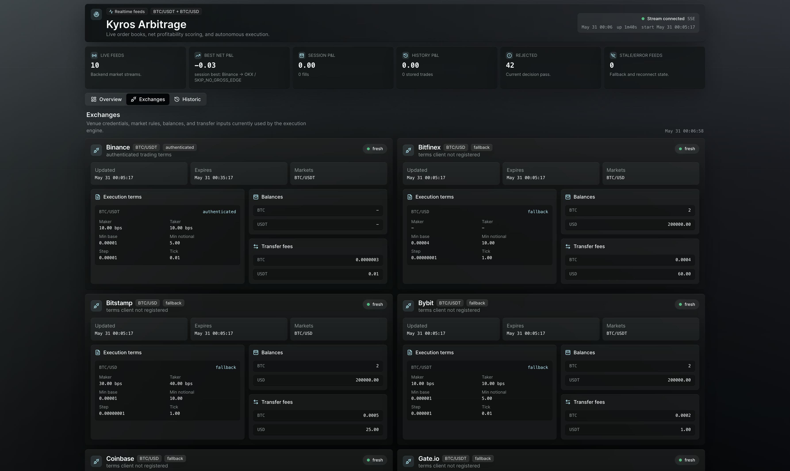
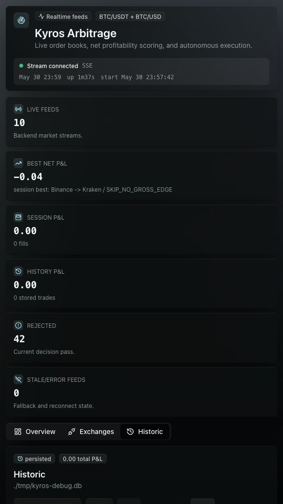

# Kyros Arbitrage

## Descripcion

Kyros Arbitrage es una web app SSR en Go para el challenge de arbitraje de Bitcoin. El sistema consume order books publicos de multiples exchanges, normaliza los mejores niveles de compra y venta, detecta oportunidades de arbitraje en tiempo real y simula ejecuciones de paper trading con balances por exchange.

El motor evalua cada ruta neta de trading fees, slippage por profundidad del libro, penalizacion por latencia, costos de rebalanceo y limites de wallet. La interfaz muestra feeds en vivo, oportunidades detectadas, ejecuciones simuladas, P&L de sesion, P&L historico, salud de conexiones, reglas de trading por exchange y controles de riesgo con circuit breaker manualmente reiniciable.

La aplicacion no coloca ordenes reales. Las credenciales opcionales de Binance y Kraken se usan solo para leer fees, restricciones y balances cuando estan disponibles. Si no hay credenciales, Kyros usa perfiles fallback visibles en la UI para mantener una demo reproducible.

## Stack tecnologico

- **Backend:** Go, `net/http`, servicios concurrentes y estado de mercado en memoria.
- **UI:** SSR con `templ`, componentes TemplUI, Datastar SSE para parches realtime.
- **Market data:** WebSockets primero, REST polling como fallback, adaptadores por exchange.
- **Exchanges:** Binance, Kraken, Coinbase, OKX, Bybit, Bitfinex, KuCoin, Gate.io, Bitstamp y Gemini.
- **Persistencia:** SQLite con migraciones `goose` y queries generadas por `sqlc`.
- **Estilos:** Tailwind CSS standalone CLI.
- **Operacion local:** `task` para generacion, pruebas, CSS, ejecucion y Docker.
- **Riesgo:** modos conservative/balanced/aggressive, reservas minimas, limites de spread/latencia/drawdown y circuit breaker sticky hasta reset manual.

## Instrucciones de instalacion

Requisitos:

- Go 1.26.1
- `task`
- `templ`
- `sqlc`
- Tailwind CSS standalone CLI

Instalacion sugerida en macOS:

```bash
brew install go-task sqlc
go install github.com/a-h/templ/cmd/templ@latest
```

Instala Tailwind CSS standalone y asegurate de que el binario `tailwindcss` este disponible en tu `PATH`.

Configura el entorno local:

```bash
cp .env.example .env
```

Variables disponibles:

```bash
ENV=development
PORT=8090
DATABASE_URL=file:./app.db
BINANCE_API_KEY=
BINANCE_API_SECRET=
KRAKEN_API_KEY=
KRAKEN_API_SECRET=
```

Las API keys son opcionales y deben tener permisos de solo lectura. Si se omiten o fallan, Kyros usa terminos fallback para la demo.

## Ejecucion local

Genera codigo, CSS y ejecuta la suite:

```bash
task check
```

Corre la aplicacion:

```bash
task run
```

Abre la app en:

```text
http://localhost:8090
```

Endpoints utiles:

- `/` dashboard SSR con feeds, oportunidades, balances, historial y controles de riesgo.
- `/stream` stream SSE de actualizaciones realtime.
- `/risk/mode` cambia el modo de riesgo.
- `/risk/reset` reinicia el circuit breaker runtime.
- `/healthz` healthcheck de proceso y feeds.
- `/api/history` historial persistido de oportunidades y ejecuciones.
- `/api/metrics` metricas de latencia de feeds y decision loop.

Para desarrollo con watchers:

```bash
task dev
```

Para Docker:

```bash
task docker-build
task docker-run
```

El contenedor escucha en `PORT` y usa `/var/lib/app/app.db` por defecto. Monta `/var/lib/app` como volumen si necesitas conservar el historial.

## Deploy en Fly.io

La app esta configurada para desplegarse como demo publica en Fly.io con una sola Machine, SQLite persistido en `/var/lib/app` y healthcheck HTTP en `/healthz`.

URL publica:

```text
https://kyros-arbitrage.fly.dev/
```

```bash
fly deploy --app kyros-arbitrage
fly status --app kyros-arbitrage
fly checks list --app kyros-arbitrage
curl -fsS https://kyros-arbitrage.fly.dev/healthz
```

No configures secrets para la primera demo publica. Si se omiten `BINANCE_API_KEY`, `BINANCE_API_SECRET`, `KRAKEN_API_KEY` y `KRAKEN_API_SECRET`, Kyros usa terminos fallback visibles en la UI.
El feed publico de Binance usa `data-api.binance.vision` y `data-stream.binance.vision` para evitar los bloqueos de geolocalizacion que suelen afectar a `api.binance.com` desde regiones cloud de Estados Unidos.

## Capturas de pantalla

### Overview realtime



### Exchanges y terminos de ejecucion



### Historico persistido



## Arquitectura

El hot path de scoring lee snapshots en memoria y evita llamadas REST mientras rankea rutas. Los feeds publicos actualizan el store de mercado; el decision loop evalua rutas directas por mercado, actualiza el ledger de paper trading y persiste oportunidades/ejecuciones en SQLite. La UI solo renderiza proyecciones del backend y recibe parches coalesced por SSE.

Los costos se calculan antes de ejecutar una simulacion:

- spread bruto entre ask y bid,
- trading fees de compra y venta,
- slippage por profundidad del order book,
- penalizacion de latencia,
- costo estimado de rebalanceo,
- restricciones de min notional, min base, tick y step size,
- balances disponibles por wallet.

El circuit breaker abre automaticamente ante drawdown critico o fallo critico de ejecucion simulada. Mientras esta abierto, el motor rechaza nuevas oportunidades con `SKIP_RISK_CIRCUIT_OPEN` hasta que un operador use `Reset circuit` en la UI.
